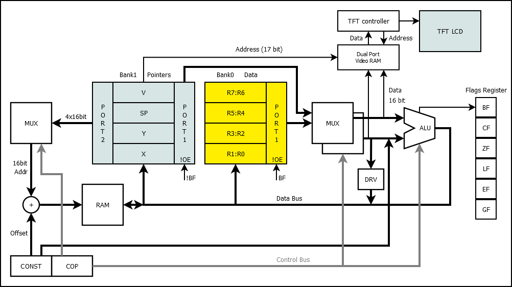

# 74HCPU

Not a very scary instruction set discrete logic processor.

* 8 bit data
* 16 bit address / 64KB RAM
* 17 bit address (in V register) / 128KW Dual Bank Video RAM
* 16 [instructions](#instruction-list)
* 8 data [registers](#registers) and 4 pointer registers in 2 banks
* 1 [flags register](#flags-register) in IO port
* 32 input ports and 32 output ports
* Assembled from 74HCxx series ICs!

## Soft!
[ASM](./ASM.md)
[UEMUL]()

## CPU structure


## How this CPU works?


[Layers of PCBs](layers/README.md)

## Instruction list
*The words 'instruction' and 'command' mean the same thing.*
```
|----------------------------------------------|f|
|   HIGH BYTE    |    LOW BYTE   |  HIGH BYTE  |l|
|F E D C  B A 9 8 7 6 5 4 3 2 1 0|   (again)   |a|
|   4   +   3 + 1 + 3  +    5    = 16          |g|
|----------------------------------------------|s|
|   ADD |  DST |1|    CONST or   | 01 0000 0001|*|
|   ADD |  DST |0| SRC |-|Z|z|I|i| 00 0000 0000|*|
|----------------------------------------------| |
|  ADDC |  DST |C| SRC |F|Z|z|I|i| 10 0001 0000|*|
|   AND |  DST |C| SRC |-|Z|z|I|i| 20 0010 0000|*|
|    OR |  DST |C| SRC |-|Z|z|I|i| 30 0011 0000|*|
|   XOR |  DST |C| SRC |-|Z|z|I|i| 40 0100 0000|*|
|   MUL |  DST |C| SRC |-|Z|z|I|i| 50 0101 0000|*|
|   UNO |  DST |0|-|TYP|F|-|-|-|-| 60 0110 0000|*|
|   MOV |  DST |C| SRC |*|Z|z|I|i| 70 0111 0000| |
|   LPM |  DST |0|EXT|D|U|-|-|-|W| 80 1000 0000| |
|    LD |  DST |V|EXT|D|U|OFFSET4| 90 1001 0000| |
|    IN |  DST |  PORT   |Z|z|I|i| A0 1010 0000| |
|--------------|8-7-6-5-4|-------|-------------| |
|   OUT | PORT |1|    CONST or   | B1 1011 0001| |
|   OUT | PORT |0| SRC |PRT|X|O|o| B0 1011 0000| |
|----------------------------------------------| |
|    ST |  SRC |V|EXT|D|U|OFFSET4| C0 1100 0000| |
|   CMP |  DST |C| SRC |-|   -   | D0 1101 0000|+|
|  CMPC |  DST |C| SRC |-|   -   | E0 1110 0000|+|
| BRNCH |  CALL  | 8 bit OFFSET  | F0 1111 0000| |
| BRNCH |   JMP  | 8 bit OFFSET  | F1 1111 0001| |
| BRNCH |   RET  | 8 bit +STACK  | F2 1111 0010| |
| BRNCH |  RETI  | 8 bit OFFSET  | F3 1111 0011| |
| BRNCH |    JL  | 8 bit OFFSET  | F4 1111 0100| |
| BRNCH |    JE  | 8 bit OFFSET  | F5 1111 0101| |
| BRNCH |   JNE  | 8 bit OFFSET  | F6 1111 0110| |
| BRNCH |    JG  | 8 bit OFFSET  | F7 1111 0111| |
| BRNCH |    JZ  | 8 bit OFFSET  | F8 1111 1000| |
| BRNCH |   JNZ  | 8 bit OFFSET  | F9 1111 1001| |
| BRNCH |    JC  | 8 bit OFFSET  | FA 1111 1010| |
| BRNCH |   JNC  | 8 bit OFFSET  | FB 1111 1011| |
| BRNCH |   JHC  | 8 bit OFFSET  | FC 1111 1100| |
| BRNCH |  JNHC  | 8 bit OFFSET  | FD 1111 1101| |
| BRNCH | AFCALL | Hi 8 bit ADDR | FE 1111 1110| |
| BRNCH |NOP/STOP|   1111 111x   | FF 1111 1111| |
|----------------------------------------------|-|
```
\* - means ZF, CF, HCF flags
\+ - means GF, EQ, LF flags

### Registers
74HCPU has two register banks.
First bank has 8 arithmetic registers.
Second bank has 4 pointers (which can be used as 8 arithmetic registers).
You can change the active bank by writing BF bit of the [flags register](#flags-register).

#### Bank0 (8 pcs 8 bits registers):
|Name|Name|
|---|---|
|R7|R6|
|R5|R4|
|R3|R2|
|R1|R0|

#### Bank1 (4 pcs 16 bit registers):
<table>
<tr>
<td>

|Name|Usage|
|---|---|
|V|Video Pointer (**17** bits)|
|SP|Stack Pointer (16 bits)|
|Y|Pointer 1 (16 bits), e.g. Destination|
|X|Pointer 0 (16 bits), e.g. Source|
16 bit pointers
</td>
<td>

|Name|Name|
|---|---|
|VH|VL|
|SPH|SPL|
|YH|YL|
|XH|XL|
or 8 bit registers
</td></tr>
</table>

Also, you can use the registers of bank 1 in the same way as bank 0: R0, R1, ... R7
(R7 will store the high half of SP, R6 the low half).

### Flags register
|Bit|Flag Name|Usage|Reason|
|---|---|---|---|
|7|-|reserved|-|
|6|BF|Bank|You can write it|
|5|GF|Greater|Compare (CMP)|
|4|~EQ|Equal (inverted)|Compare (CMP)|
|3|LF|Less|Compare (CMP)|
|2|ZF|Zero|Arithmetic|
|1|CF|Carry|Arithmetic|
|0|HCF|Half Carry|Arithmetic|

### ADD, ADDC, AND, OR, XOR, MUL are binary commands
```
You can use it:
CMD Rd, Rs
Where Rd - is destination register.
And Rs - is source register.
These commands work like this:
Rd := Rd CMD Rs
For example, ADD command does this:
ADD R0, R1 -> R0 := R0 + R1
Also you can use immediate value:
CMD Rd, CONST
(You can use CONST with any command: ADD, ADDC, AND, OR, XOR, MUL)
There is only one exception, the MUL command.
A pair of registers is needed to store the multiplication results.
For example:
MUL R1, R2 will store result into R1:R0 pair.
That is, R1:R0 := R1 * R2.
```

### MUL Examples
```
  Rd select output Pair:
      _________
  Rd /         \ Pair  Rd   Rs
     |         \/
MUL R0, R1 -> R1:R0 := R0 * R1
MUL R1, R0 -> R1:R0 := R1 * R0
MUL R1, R2 -> R1:R0 := R1 * R2
MUL R1, R7 -> R1:R0 := R1 * R7
MUL R2, R3 -> R3:R2 := R2 * R3
MUL R2, R7 -> R3:R2 := R2 * R7
....

The MUL command uses the following register pairs to store result:
R1:R0 (when Rd is R0 or R1)
R3:R2 (when Rd is R2 or R3)
R5:R4 (when Rd is R4 or R5)
R7:R6 (when Rd is R6 or R7)
Rd is used to select output register pair.
```

### Instruction options
```
C - Low byte [of command] contains constant value (1) or options (0).
Z - Will reset high nibble of SRC register before use.
z - Will reset low nibble of SRC register before use.
I - Will invert high nibble of SRC register before use.
i - Will invert low nibble of SRC register before use.
F - Set CF flag to TRUE while executing command.
W - Command will work with word, not byte
V - Command will work with Video RAM
D - Down, decrease pointer after command
U - Up, increase pointer after command
OFFSET4 - 4 bit size int offset to current pointer
O - Out will write to high nibble of port
o - Out will write to low nibble of port
X - Out will toggle bits of port by mask in register
SRC - Index of source register (0-7)
DST - Index of destination register (0-7)
TYP - Kind of unary operation (0-3)
EXT - Index of pointer register (0-3)
PORT + PRT - 5 bit of port index
```

### UNO - unary commands
```
There are four unary commands: LSR, LSRC, INV, SWAP.
LSR shift register bits to the right. CF flag get value of right (low) bit.
LSRC do same, but left (high) bit get value of CF.
SWAP simply swap the nibbles.
INV simply invert all the bits.
```

### LPM - Load Program Memory
This command read data from ROM, not RAM.
This command stores data in the same ROM that stores the commands themselves.

### LD, ST - Memory commands
```
LD - LoaD data from memory
ST - STore date to memory
V - 0 for RAM and 1 for Video RAM
SRC/DST - register to read(SRC)/write(DST)
EXT - register pair which store pointer to memory
D - Decrement pointer after use
U - Increment pointer after use
OFFSET4 - 4 bit integer offset (-8...+7)
(CPU whill read/write memory with address ptr(EXT) + OFFSET4)
Examples:
LD R0, X    ; read memory data from X pointer into the R0 register
ST Y, R1    ; write data from R1 into memory with address from Y pointer
ST YI, R1   ; write data and increment Y pointer
ST YD, R1   ; write data and decrement Y pointer
ST Y+5, R1  ; write data into memory address Y+5
LDV R7, V   ; read data from Video RAM with address V and store it into R7 (R7:R6 pair)
LDV R7, V+1 ; <b>disabled</b> command, you can use displacement only with X, Y and SP pointers
```

### BRNCH - Branch commands
```
CALL - call a function by offset
AFCALL - call a function to an absolute address
RET - return to the address stored on the stack
RETI - return from interrupt to the address stored on the stack
JMP - go by offset
NOP - no operation (do nothing)
STOP - the processor will stop executing the program
JL, JE, JNE, JG, JZ, JNZ, JC, JNC, JHC, JNHC - conditional jump instructions
JL - jump if less
JE - jump if equal
JNE - jump if not equal
JG - jump if greater
JZ - jump if zero
JNZ - jump if not zero
JC - jump if carry
JNC - jump if not carry
JHC - jump if half carry
JNHC - jump if not half carry
```
