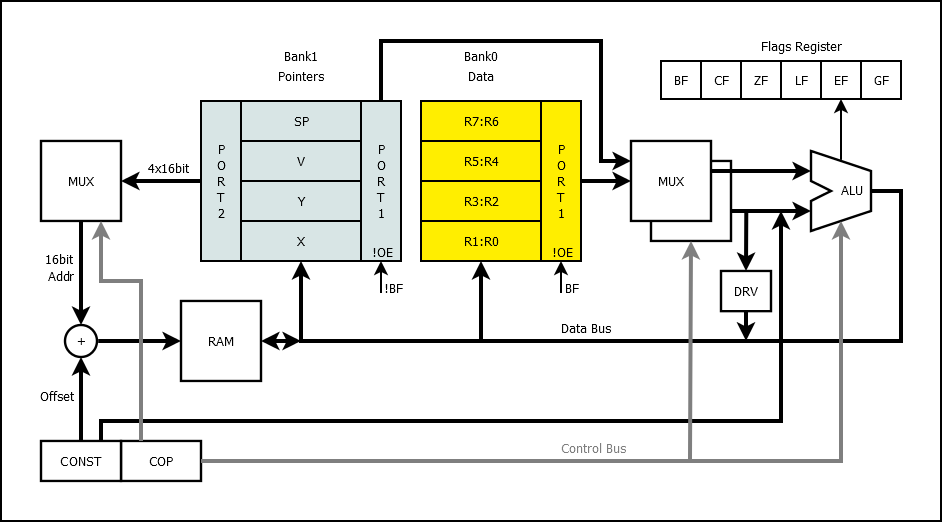

# 74HCPU

Not a very scary instruction set discrete logic processor.

* 8 bit data
* 16 bit address / 64KB RAM
* 16 instructions
* 8 data registers and 4 pointer registers in 2 banks
* 1 flag register in IO port



## How CPU works?


[Layers of PCBs](layers/README.md)

## Instruction list

```
|----------------------------------------------|f|
|   HIGH BYTE    |    LOW BYTE   |  HIGH BYTE  |a|
|0 1 2 3  4 5 6 7 8 9 A B C D E F|   (again)   |g|
|   4   +   3 + 1 + 3  +    5    = 16          |l|
|----------------------------------------------|s|
|   ADD |  DST |C| SRC |-|Z|z|I|i| 00 0000 0000|*|
|  ADDC |  DST |C| SRC |F|Z|z|I|i| 10 0001 0000|*|
|   AND |  DST |C| SRC |-|Z|z|I|i| 20 0010 0000|*|
|    OR |  DST |C| SRC |-|Z|z|I|i| 30 0011 0000|*|
|   XOR |  DST |C| SRC |-|Z|z|I|i| 40 0100 0000|*|
|   MUL |  DST |C| SRC |-|Z|z|I|i| 50 0101 0000|*|
|   UNO |  DST |0|-|TYP|F|-|-|-|-| 60 0110 0000|*|
|   MOV |  DST |0| SRC |*|Z|z|I|i| 70 0111 0000| |
|   LPM |  DST |0|EXT|D|U|-|-|-|W| 80 1000 0000| |
|    LD |  DST |V|EXT|D|U|OFFSET4| 90 1001 0000| |
|    IN |  DST |  PORT   |Z|z|I|i| A0 1010 0000| |
|--------------|7-8-9-A-B|-------|-------------|-|
|   OUT | PORT |C| SRC |PRT|X|O|o| B0 1011 0000| |
|    ST |  SRC |V|EXT|D|U|OFFSET4| C0 1100 0000| |
|   CMP |  DST |C| SRC |-|   -   | D0 1101 0000|+|
|  CMPC |  DST |C| SRC |-|   -   | E0 1110 0000|+|
| BRNCH |  CALL  | 8 bit OFFSET  | F0 1111 0000| |
| BRNCH |   JMP  | 8 bit OFFSET  | F1 1111 0001| |
| BRNCH |   RET  | 8 bit +STACK  | F2 1111 0010| |
| BRNCH |  RETI  | 8 bit OFFSET  | F3 1111 0011| |
| BRNCH |    JL  | 8 bit OFFSET  | F4 1111 0100| |
| BRNCH |    JE  | 8 bit OFFSET  | F5 1111 0101| |
| BRNCH |   JNE  | 8 bit OFFSET  | F6 1111 0110| |
| BRNCH |    JG  | 8 bit OFFSET  | F7 1111 0111| |
| BRNCH |    JZ  | 8 bit OFFSET  | F8 1111 1000| |
| BRNCH |   JNZ  | 8 bit OFFSET  | F9 1111 1001| |
| BRNCH |    JC  | 8 bit OFFSET  | FA 1111 1010| |
| BRNCH |   JNC  | 8 bit OFFSET  | FB 1111 1011| |
| BRNCH |   JHC  | 8 bit OFFSET  | FC 1111 1100| |
| BRNCH |  JNHC  | 8 bit OFFSET  | FD 1111 1101| |
| BRNCH | AFCALL | Hi 8 bit ADDR | FE 1111 1110| |
| BRNCH |NOP/STOP|   1111 111x   | FF 1111 1111| |
|----------------------------------------------|-|
```

### ADD, ADDC, AND, OR, XOR, MUL is binary commands.
```
You can use it:
CMD Rd, Rs
Where Rd - is destination register.
And Rs - is source register.
These commands work like this:
Rd := Rd CMD Rs
For example, ADD command does this:
ADD R0, R1 -> R0 := R0 + R1
There is only one exception, the MUL command.
A pair of registers is needed to store the multiplication results.
For example:
MUL R1, R2 will store result into R1:R0 pair.
That is, R1:R0 := R1 * R2.
```

### Flags
```
C - Low byte contains constant value (1) or flags (0).
Z - Will reset high nibble of SRC before use.
z - Will reset low nibble of SRC before use.
I - Will invert high nibble of SRC before use.
i - Will invert low nibble of SRC before use.
```

### Examples:
```
MUL R0, R1 -> R1:R0 := R0 * R1
MUL R1, R2 -> R1:R0 := R1 * R2
MUL R2, R3 -> R3:R2 := R2 * R3
MUL R2, R7 -> R3:R2 := R2 * R7
....
```

```
The command uses the following register pairs:
R1:R0
R3:R2
R5:R4
R7:R6
```

### UNO - unary commands.
```
There are four unary commands: LSR, LSRC, INV, SWAP.
LSR shift register bits to the right. CF flag get value of right (low) bit.
LSRC do same, but left (high) bit get value of CF.
SWAP simply swap the nibbles.
INV simply invert all the bits.
```
